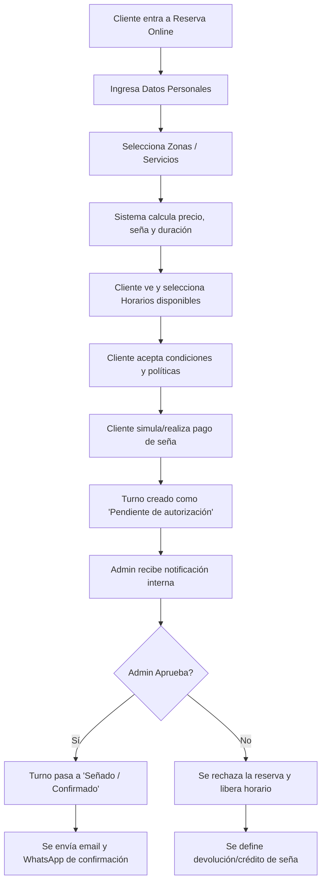

# flows_graph.md - Flujos de Lógica del Sistema

## 🔄 Flujo de Reserva Online (Público)


## ⏱️ Regla de Cálculo de Duración y Redondeo
```text
1. Base = Duración de la zona de mayor tiempo.
2. Adicionales = Cada zona adicional suma 50% de su duración base.
3. Si es cliente nuevo = Suma 10 minutos.
4. Redondeo = Se redondea hacia arriba al múltiplo de 10 minutos más cercano.
```
